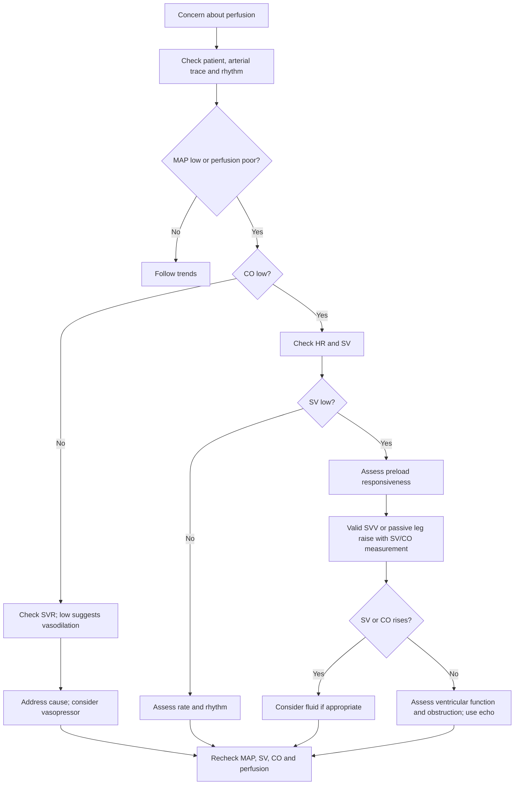

FloTrac uses the arterial pressure waveform to estimate blood flow. On a HemoSphere monitor it updates stroke volume (SV), stroke volume variation (SVV), cardiac output (CO), mean arterial pressure (MAP), and systemic vascular resistance (SVR) about every 20 seconds. It is most useful when the numbers are read together: *Is pressure low because flow is low, vascular tone is low, or both?* [1]

## A quick way through the display

1. **Check the patient and the trace first.** A damped or distorted arterial waveform, incorrect zeroing, or an abrupt change in rhythm can make the displayed pattern misleading. Look at mentation, skin, urine output, lactate trend, and the wider clinical picture.
2. **Compare MAP with CO.** Low MAP with preserved CO and low SVR suggests vasodilation. Low MAP *and* low CO calls for a closer look at heart rate and SV. A reassuring MAP does not by itself guarantee adequate flow.
3. **If CO is low, split it into SV × heart rate.** Low SV may reflect poor filling, ventricular dysfunction, or obstruction. Bradycardia can lower CO despite a reasonable SV; tachycardia may shorten filling time and reduce SV. Check rhythm, bleeding or other losses, and consider bedside echo.
4. **Ask whether more preload would increase SV.** High SVV can support fluid responsiveness in an appropriately ventilated patient. When SVV is unreliable, measure the change in SV or CO during a passive leg raise. A rise around 10% supports responsiveness. Give fluid only if increasing flow is likely to help and the risk of congestion is acceptable. [2, 3]
5. **Use SVR to explain the pressure–flow pattern.** Low SVR with low MAP and maintained CO points toward vasodilation; address the cause and consider a vasopressor. High SVR with low CO suggests increased afterload or compensatory vasoconstriction. Raising pressure further may not improve flow.

## Bedside algorithm

**Where SVV trips people up:** Respiratory variation is most interpretable during controlled mechanical ventilation. Spontaneous breathing, arrhythmias, low tidal volumes, and poor lung compliance can make a high or low SVV misleading. Newer FloTrac algorithms attempt to filter some irregular beats, but that does not make SVV dependable in every rhythm or ventilator setting. [1, 3]

**Where CO trips people up:** FloTrac estimates CO from the arterial waveform. Major changes in vascular tone, particularly severe vasodilation, can reduce its accuracy. When the number conflicts with the examination, confirm the picture with another method such as echo. Follow the *response* to an intervention and reassess perfusion rather than treating an isolated reading. [4]

### Sources

1. [Edwards Lifesciences: FloTrac system](https://www.edwards.com/ca-en/healthcare-professionals/products-services/hemodynamic-monitoring/flotrac)
2. [Monnet et al.: Passive leg raising and fluid responsiveness, systematic review and meta-analysis](https://pubmed.ncbi.nlm.nih.gov/26825952/)
3. [Monnet, Marik and Teboul: Prediction of fluid responsiveness, an update](https://pmc.ncbi.nlm.nih.gov/articles/PMC5114218/)
4. [Review of arterial waveform analysis for goal-directed therapy](https://pmc.ncbi.nlm.nih.gov/articles/PMC4058462/)
